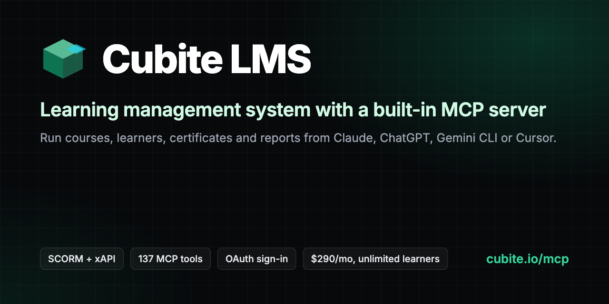

# Cubite LMS: learning management system with a built-in MCP server



Cubite LMS (https://cubite.io) is a hosted learning management system for course sellers,
training teams and universities: native SCORM and xAPI with a built-in LRS, quizzes and graded
assignments, certificates, cohorts, learning paths, discussions, Stripe and SureCart checkout, and
white-label sites on your own domain. Flat $290/month or $2,900/year with unlimited learners and
courses. It is a hosted alternative for teams moving off LearnDash, Moodle, Thinkific or TalentLMS.

Every Cubite site includes a hosted MCP server, so Claude, ChatGPT, Gemini CLI, Cursor or any MCP
client can run the LMS for you: 137 tools to build courses, upload SCORM and xAPI packages, enroll
learners or whole cohorts, issue certificates, grade, moderate discussions and pull reports. You
sign in through the browser (OAuth 2.1); there is no API key to copy.

This repository holds the public connection files. The server itself is hosted by Cubite; its
source is not published here.

- Server URL: `https://cubite.io/api/mcp/mcp` (streamable HTTP)
- Auth: OAuth 2.1 with dynamic client registration (browser sign-in, no API key) for Claude and
  ChatGPT; scoped API keys (`Authorization: Bearer ck_...`) for command-line and server-to-server
  clients
- Registry: `io.cubite/lms` in the official MCP registry
- Docs: https://cubite.io/mcp (markdown: https://cubite.io/mcp.md)

## Connect

| Client | Guide | Auth |
|---|---|---|
| Claude (web, desktop, Claude Code) | https://cubite.io/mcp/claude | OAuth sign-in. One-click: [Add to Claude](https://claude.ai/customize/connectors?modal=add-custom-connector&connectorName=Cubite&connectorUrl=https%3A%2F%2Fcubite.io%2Fapi%2Fmcp%2Fmcp) |
| ChatGPT (developer mode) | https://cubite.io/mcp/chatgpt | OAuth sign-in |
| Gemini CLI | https://cubite.io/mcp/gemini | This repo is a Gemini CLI extension (see below) |
| Cursor | https://cubite.io/mcp/cursor | OAuth sign-in. One-click: [Install in Cursor](cursor://anysphere.cursor-deeplink/mcp/install?name=cubite&config=eyJ1cmwiOiJodHRwczovL2N1Yml0ZS5pby9hcGkvbWNwL21jcCJ9), or a scoped API key |
| Windsurf and other HTTP clients | https://cubite.io/mcp/cursor | Scoped API key |

### Claude Code

```bash
claude mcp add --transport http cubite https://cubite.io/api/mcp/mcp
```

Then run `/mcp` inside Claude Code to complete the browser sign-in.

### Gemini CLI extension

```bash
gemini extensions install https://github.com/amirtds/cubite-mcp
```

`gemini-extension.json` registers the server with OAuth enabled; `GEMINI.md` gives the model the
context it needs to administer a site safely. Where a browser sign-in is not possible, use a scoped
API key instead (Cubite Admin, your site, Integrations) as an `Authorization: Bearer` header.

### Any HTTP MCP client with an API key

```json
{
  "mcpServers": {
    "cubite": {
      "url": "https://cubite.io/api/mcp/mcp",
      "headers": { "Authorization": "Bearer ck_your_key_here" }
    }
  }
}
```

(Gemini CLI uses `httpUrl` instead of `url`.)

## What the assistant can do

- Courses and content: create courses, write lessons and units, add quizzes, assignments and
  graded activities, upload SCORM or xAPI packages.
- Learners: invite and create users, enroll individuals or a whole cohort, manage groups, revoke
  access.
- Certificates, grading, discussions: issue and revoke certificates, grade assignments and open
  responses, moderate discussion threads.
- Analytics: site overview, per-course engagement, drop-off funnel, exam item analysis, at-risk
  learners, grading turnaround, revenue; Google Search Console reads where connected.
- Site and marketing: settings and theme, homepage, pages and blog posts.
- Search and fetch across courses, pages and posts, which also powers ChatGPT's research modes.

Permissions are granted per connection or per key and listed on the consent screen before you
approve; a write permission also grants the matching read. Full list: https://cubite.io/mcp.

## Compare

Other LMS vendors ship MCP servers too. A dated, sourced comparison of what each can read and
write: https://cubite.io/compare/lms-mcp-servers

## Support

amir@cubite.io. Files in this repository are MIT licensed; the hosted server and the Cubite
platform are not.
